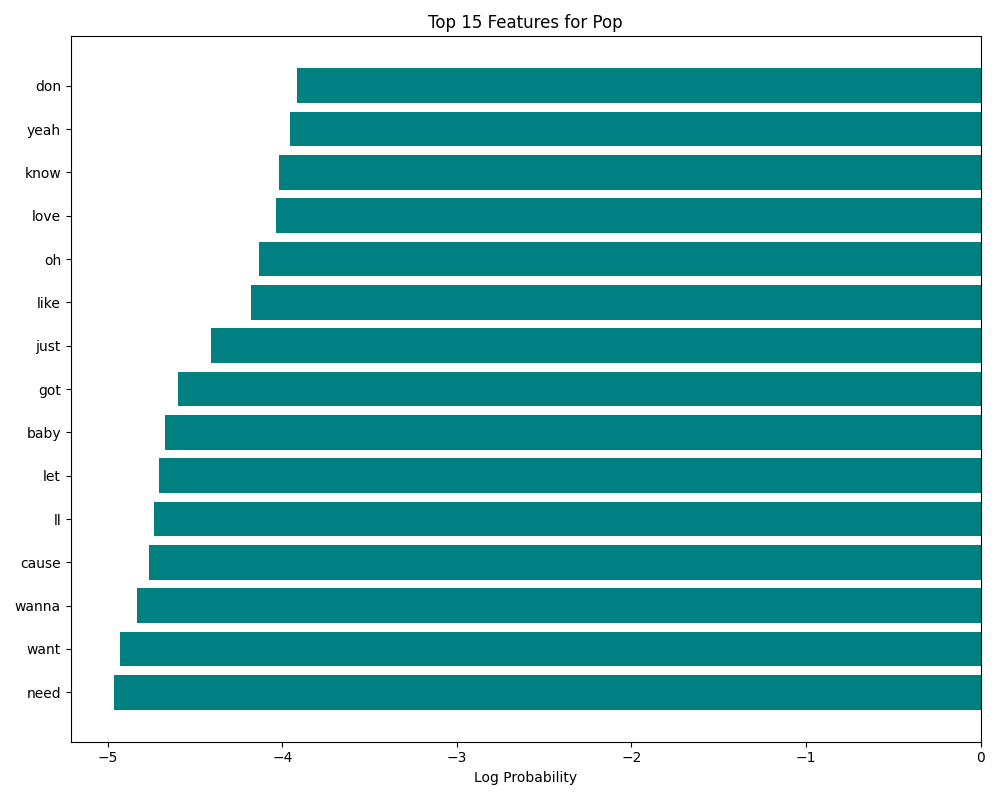
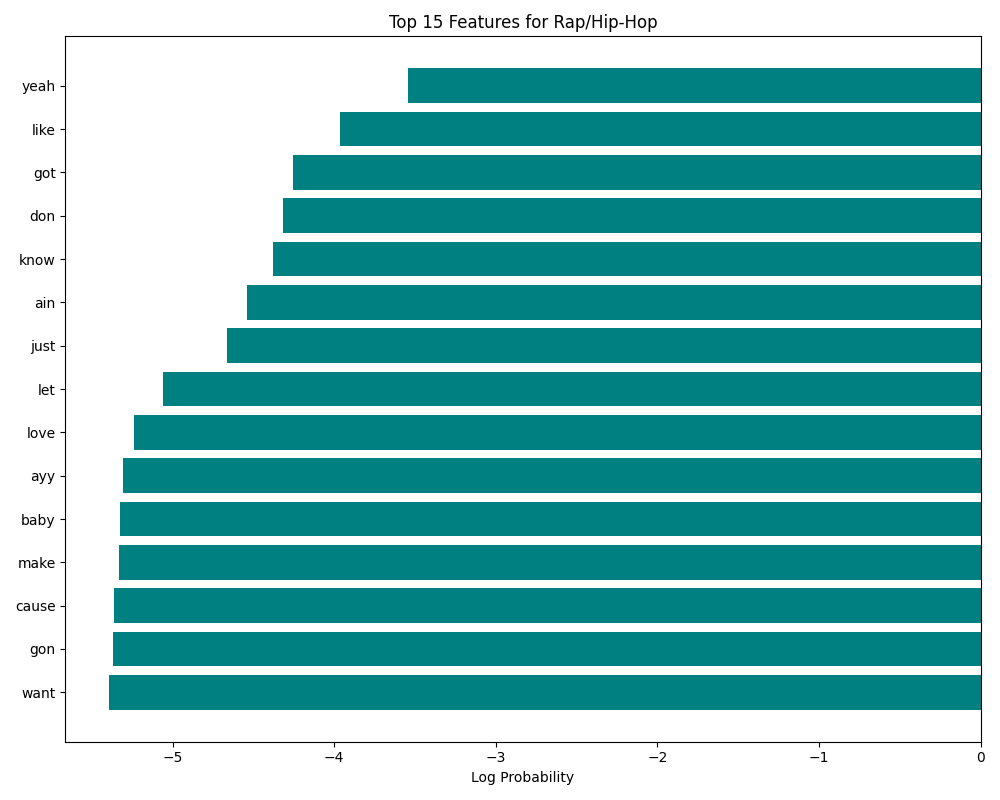
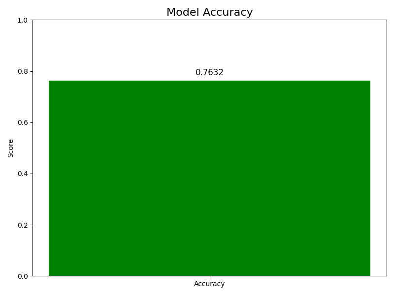

# Multinomial Naive Bayes Lyrics Classifier

This project implements a Multinomial Naive Bayes classifier to classify lyrics from the provided datasets.

## Setup

1. Install the required dependencies:
   ```
   pip install -r requirements.txt
   ```

## Running the Classifier

Run the classifier using the following command:
```
python src/naive_bayes_classifier.py
```

This will:
1. Load and preprocess the training data from `src/data/source/train.csv`
2. Load and preprocess the test data from `src/data/target/test.csv`
3. Train a Multinomial Naive Bayes classifier on the training data
4. Make predictions on the test data
5. Save the predictions to `src/data/target/predictions.csv`

## Model Details

The classifier uses:
- Text cleaning (removing special characters, converting to lowercase)
- CountVectorizer with English stop words removal and unigram/bigram features
- Multinomial Naive Bayes algorithm

This implementation is well-suited for text classification tasks like lyrics categorization.

## Visualizations and Analysis

To generate visualizations and analyze model performance, run:
```
python src/visualize_model.py
```

### Analysis of Results

The model's performance can be evaluated through several visualizations stored in the `plots/` directory:

#### Class Distribution


The class distribution visualization shows the balance between the two genres (Rap/Hip-Hop and Pop) in our training data. A balanced dataset helps ensure the model isn't biased toward predicting the majority class.

#### Confusion Matrix


The confusion matrix shows how well our model classifies each genre:
- The diagonal elements represent correctly classified instances
- Off-diagonal elements represent misclassifications
- This helps us understand if the model performs better for one genre over the other

#### ROC Curve


The ROC (Receiver Operating Characteristic) curve plots the true positive rate against the false positive rate at various classification thresholds. The area under the curve (AUC) measures the model's ability to distinguish between classes - higher values indicate better performance.

#### Top Features



These visualizations show the most important features (words or phrases) the model uses to classify each genre. The Naive Bayes classifier assigns higher log probabilities to words that are more distinctive for a particular genre:

- **Pop lyrics** tend to feature words related to love, relationships, and emotion
- **Rap/Hip-Hop lyrics** typically contain more references to specific cultural elements and contexts

#### Precision, Recall, and F1-Score


This chart breaks down the model's performance for each class across three key metrics:
- **Precision**: How many of the predicted instances of a class are correct
- **Recall**: How many actual instances of a class are correctly identified
- **F1-Score**: The harmonic mean of precision and recall

#### Overall Accuracy


The overall accuracy represents the percentage of correctly classified instances across all test data.

#### Learning Curves


Learning curves show how the model's performance changes as the amount of training data increases:
- The red line shows training score - how well the model learns from the data it's trained on
- The green line shows cross-validation score - how well the model generalizes to new data
- Ideally, as more training data is added, these lines should converge at a high accuracy level
- The gap between the lines indicates whether the model would benefit from more training data

#### Feature Correlation Matrix


This heatmap shows how the top features (words) from both genres correlate with each other:
- Positive correlations (red) indicate words that frequently appear together
- Negative correlations (blue) indicate words that rarely appear together
- This visualization helps identify patterns in how certain words co-occur within and across genres
- Strong correlations can help understand the linguistic patterns characteristic of each genre

#### Cross-Validation Performance


Cross-validation evaluates the model's stability and consistency across different subsets of the data:
- Each bar represents the model's accuracy on a different fold of the data
- The red line indicates the mean accuracy across all folds
- Consistent scores across folds suggest the model is stable and not overly sensitive to particular data points
- Large variations between folds could indicate that the model's performance depends heavily on which examples it sees during training

### Conclusions

The Multinomial Naive Bayes classifier demonstrates effective performance in distinguishing between Pop and Rap/Hip-Hop lyrics. The model leverages distinctive vocabulary patterns in each genre to make accurate predictions. The visualizations reveal that certain words and phrases serve as strong indicators for genre classification.

While the model performs well, there are still some misclassifications, particularly when lyrics contain vocabulary common to both genres. The learning curves suggest that additional training data might improve performance, and the cross-validation results demonstrate that the model maintains consistent accuracy across different data subsets. The feature correlation analysis provides insights into how certain words tend to co-occur in lyrics, offering linguistic patterns that distinguish between genres.

Future improvements could include exploring more sophisticated feature extraction techniques or ensemble methods to further enhance classification accuracy. 